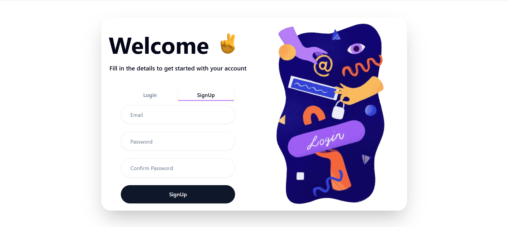
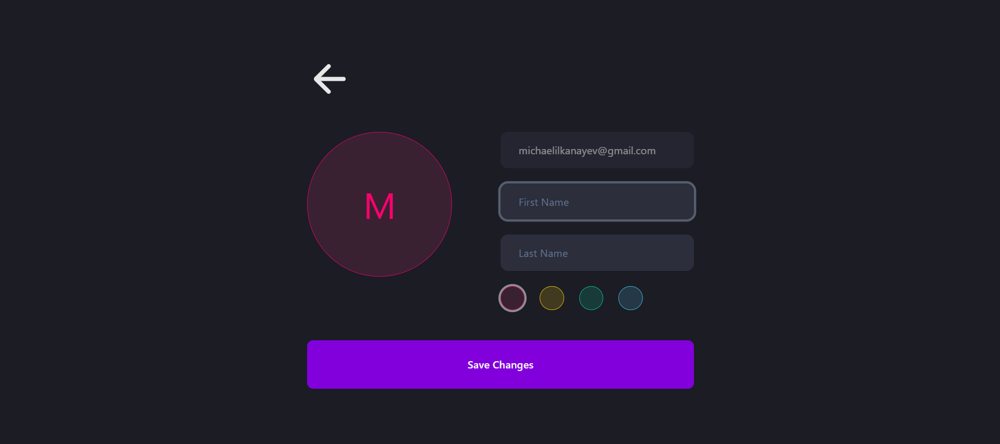
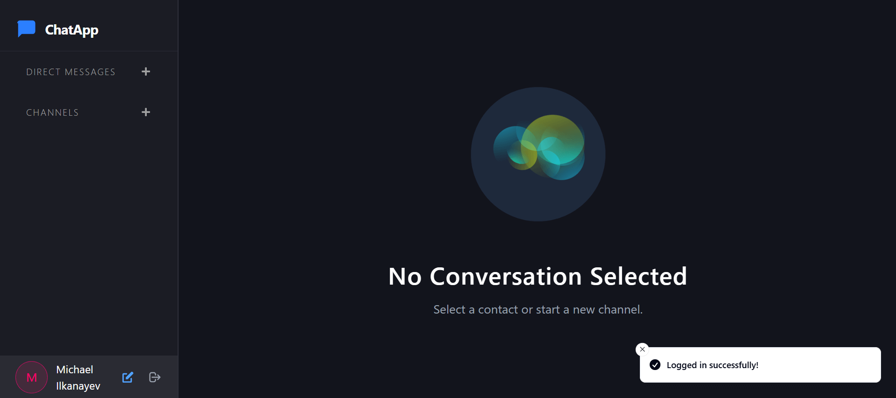
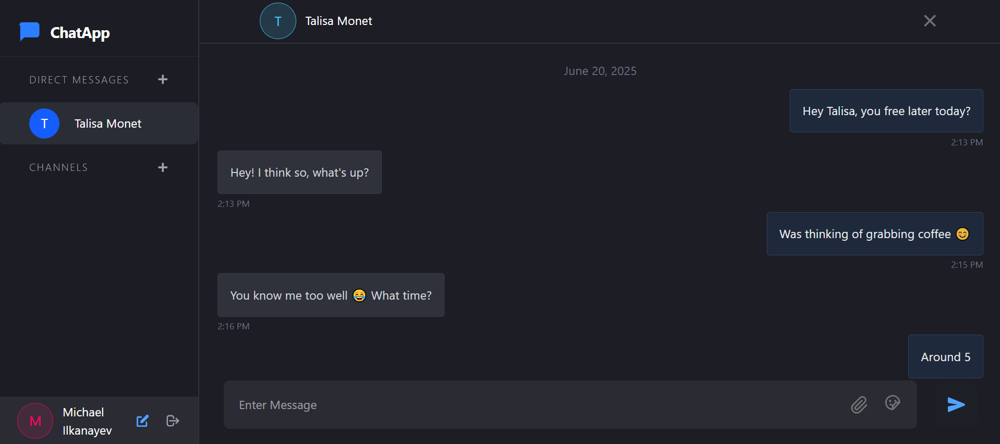
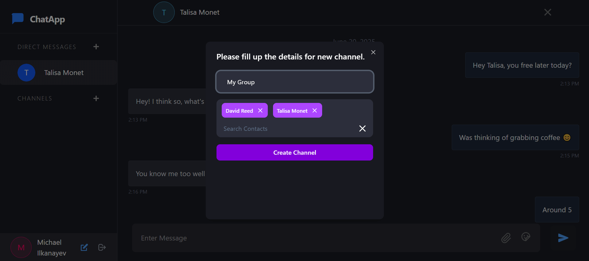
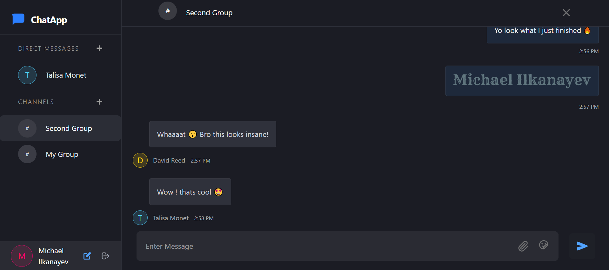

# 💬 Realtime Chat App

A fully responsive real-time chat application built with **React**, **Node.js**, **MongoDB**, **Socket.io**, and **Zustand**.  
Designed for seamless one-on-one and group communication with modern UI and instant updates.

---

## 📸 Screenshots

<table>
  <tr>
    <td align="center" valign="top">
      
      <p><strong>Login / Signup</strong></p>
    </td>
    <td align="center" valign="top">
      
      <p><strong>Profile Editing</strong></p>
    </td>
  </tr>
  <tr>
    <td align="center" valign="top">
      
      <p><strong>Home Page</strong></p>
    </td>
    <td align="center" valign="top">
      
      <p><strong>Direct Messages</strong></p>
    </td>
  </tr>
  <tr>
    <td align="center" valign="top">
      
      <p><strong>Channel Creation</strong></p>
    </td>
    <td align="center" valign="top">
      
      <p><strong>Group Chat</strong></p>
    </td>
  </tr>
</table>


---

## ⚙️ Tech Stack

| 🖥️ Frontend | 🛠️ Backend |
|-------------|------------|
| ⚛️ **React** – Component-based SPA architecture <br> 🎨 **Tailwind CSS** – Utility-first styling <br> 🧩 **ShadCN UI** – Accessible UI kit <br> 🧠 **Zustand** – Global state management <br> 🔌 **Socket.io Client** – Real-time updates <br> 📡 **Context API** – Auth/socket state <br> 😄 **Emoji Picker** – Emoji support <br> | 🚀 **Node.js + Express** – Scalable API <br> 🗃️ **MongoDB (Mongoose)** – Document database <br> 🔐 **JWT Auth** – Secure login/session <br> 📷 **Multer** – File upload support <br> 📥 **Download API** – File delivery endpoints <br> 💬 **Socket.io** – Real-time chat transport |


---

## 💬 Chat Modes

### 👤 Direct Messages

- Private one-on-one messages
- Realtime delivery via Socket.io
- Text + file support
- Typing indicators and timestamps

### 👥 Group Channels

- Create or join channels
- Multi-user conversation with broadcasted messages
- Socket rooms for performance
- Member avatars and metadata shown

---

## 🛠️ Installation & Setup

```bash
# Clone the repository
git clone https://github.com/michaelilkanayev1997/RealtimeChatApp.git
cd RealtimeChatApp

# Frontend setup
cd client
npm install

# Backend setup
cd ../server
npm install

# Create your .env file for server (Mongo URI, JWT, etc.)
